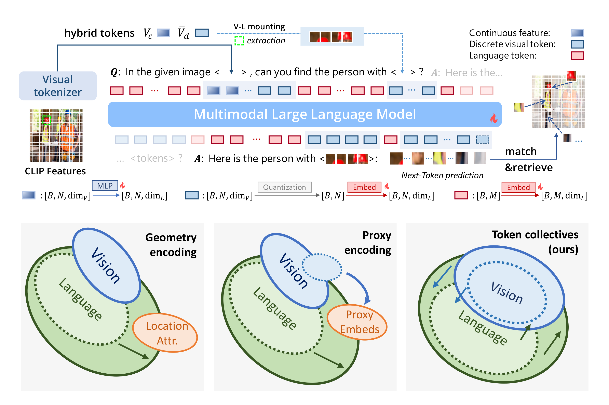

# [ClawMachine: Learning to Fetch Visual Tokens for Referential Comprehension](https://arxiv.org/abs/2406.11327)

## Introduction
This is the official implementation of *ClawMachine: Learning to Fetch Visual Tokens for Referential Comprehension* (ICLR 2025).

In this study, we propose **ClawMachine**, offering a new methodology that explicitly notates each entity using token collectives—groups of visual tokens that collaboratively represent higher-level semantics. 



A hybrid perception mechanism is also explored to perceive and understand scenes from both discrete and continuous spaces.

The core code of our model is now released, please stay tuned for the weights and further updates!

## Acknowledgements
This repository was built off of [LLaVA](https://github.com/haotian-liu/LLaVA) and [LaVIT](https://github.com/jy0205/LaVIT).

## Citation
```
@misc{clawmachine,
      title={ClawMachine: Learning to Fetch Visual Tokens for Referential Comprehension}, 
      author={Tianren Ma and Lingxi Xie and Yunjie Tian and Boyu Yang and Qixiang Ye},
      year={2024},
      eprint={2406.11327},
      archivePrefix={arXiv},
      primaryClass={cs.CV},
      url={https://arxiv.org/abs/2406.11327}, 
}
```